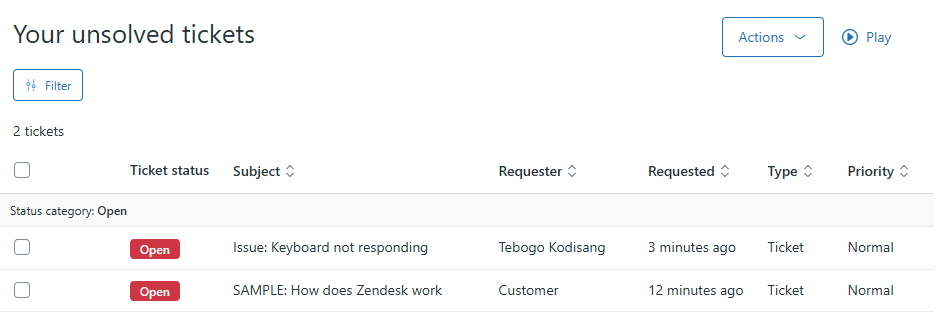
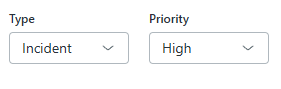
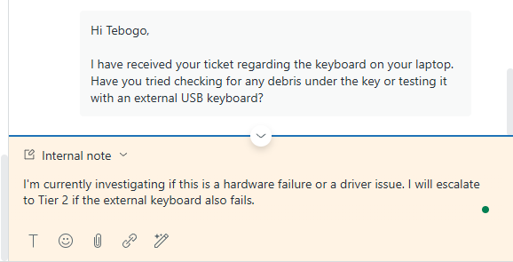
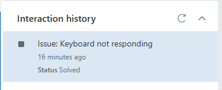

# Zendesk Lab Project

This project shows step-by-step what I did while working in Zendesk.  
It demonstrates hands-on experience with creating, handling, and resolving support tickets.

---

## Step 1: Create a Customer Ticket (Email)
- Use your personal email (Gmail/Outlook).  
- Send an email to Zendesk support address.  
  - I sent myself a ticket with **Subject:** "Issue: Keyboard not responding", as if I were a client.  
   
  - The **Body of the email had:** "The 'E' key has stopped working on my laptop."  
- Then I went to Zendesk “Views” page to see the new ticket.  

---

## Step 2: Categorize the Ticket
- I then opened the ticket in Zendesk.  
- I added a **Tag:** `hardware_issue`  
- I then set the **Type:** to `Incident` and **Priority:** to `High` since a keyboard can make work stop.  
 

---

## Step 3: Respond to the Customer
- I then typed a **Public Reply:**  
 
- Then I clicked **Submit as Open** to send the reply.

---

## Step 4: Add an Internal Note
- I then clicked the **Internal Note** tab (yellow background).  
- I then typed a note for the team, keeping the communication clear, concise, and easy to understand:  
 
- I then clicked **Submit as Open** again.

---

## Step 5: Close the Ticket
- Click the down arrow next to **Submit as Open** and choose **Submit as Solved**.  
 

---

## Conclusion

Through this project, I demonstrated the full lifecycle of customer support in Zendesk:  

1. **Receiving requests** – showing that I can capture tickets from multiple channels.  
2. **Handling tickets** – triaging, categorizing, prioritizing, and responding professionally.  
3. **Resolving issues** – closing tickets and documenting actions for the team.  

This proves I can manage IT support requests efficiently, communicate clearly with customers and team members, and maintain proper internal documentation. 